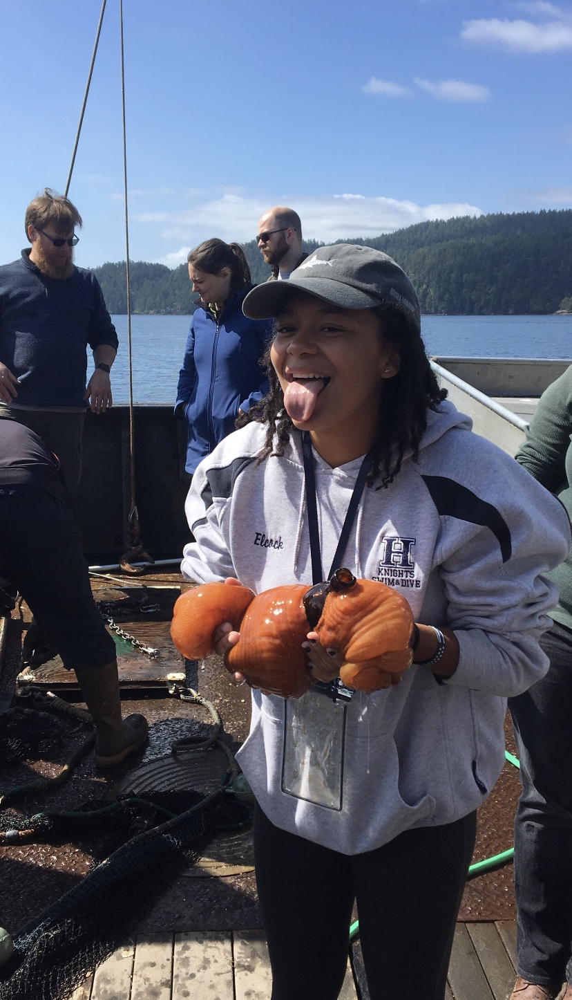

 
 

 

Twitter: @Curly_Biologist

Instagram: @webberschutlz

Pronouns: She / Her

I am an early career shark scientist interested in shark biomechanics, functional morphology, and conservation. I graduated from Rutgers University in May 2020 with a degree in marine biology. I am currently applying to graduate schools with the hopes of continuing my studies in sharks science. I enjoy marine science because there is an endless road discovering new things about the ocean and the animals that live in it. I specifically enjoy shark research because it combines my love of hands on experiences with my curiosity of sharks and how they interact with their environment. I decided to be a part of #BlackInMarineScienceWeek because I think the world should know that Black people are a part of marine science even if you don’t see them on TV or in articles. BIPOC deserve to see representation in STEM fields and this week is a way to help make that happen.