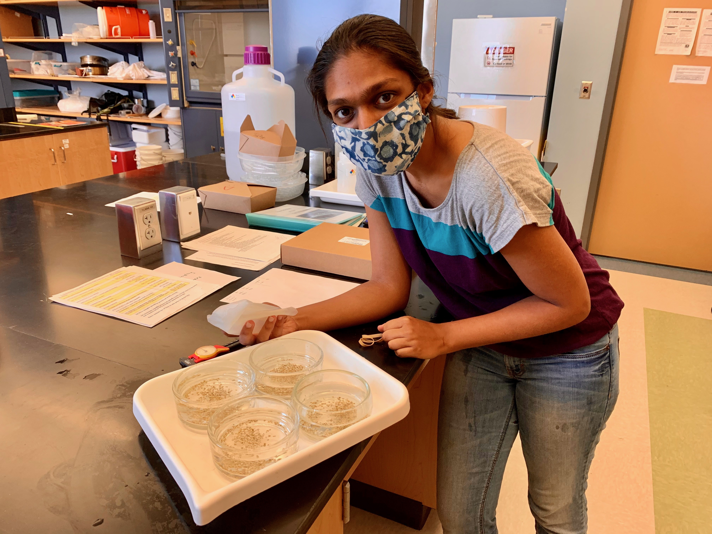
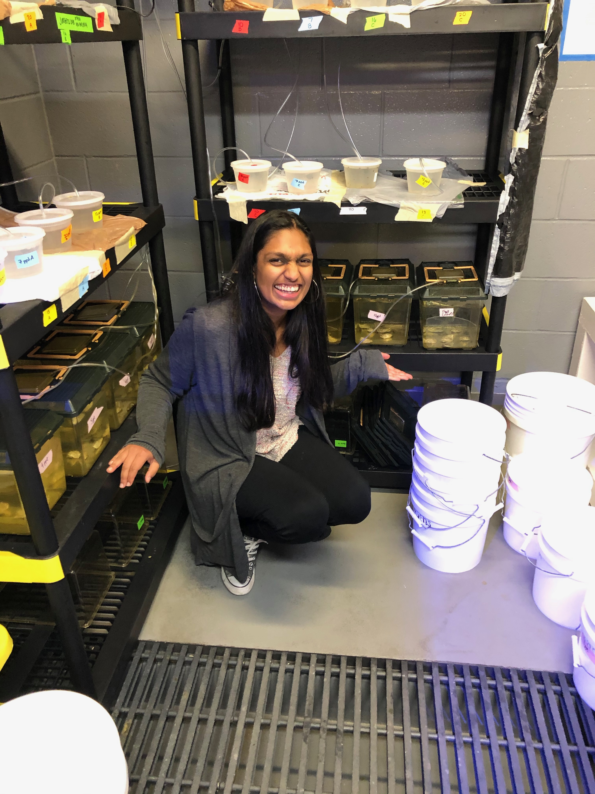

 
 

 

Twitter: @AquaticAnika

Pronouns: She / Her

I am a Master’s student in Marine Biology at Texas A&M at Galveston. I am studying the effects of multiple stressors on oyster populations in the Gulf of Mexico and am curious about the intersection between science and policy. I aspire to be an advocate for historically excluded voices in STEM and am so excited to highlight Black excellence in my field! I am thrilled to be supporting #BlackInMarineScienceWeek!!! 