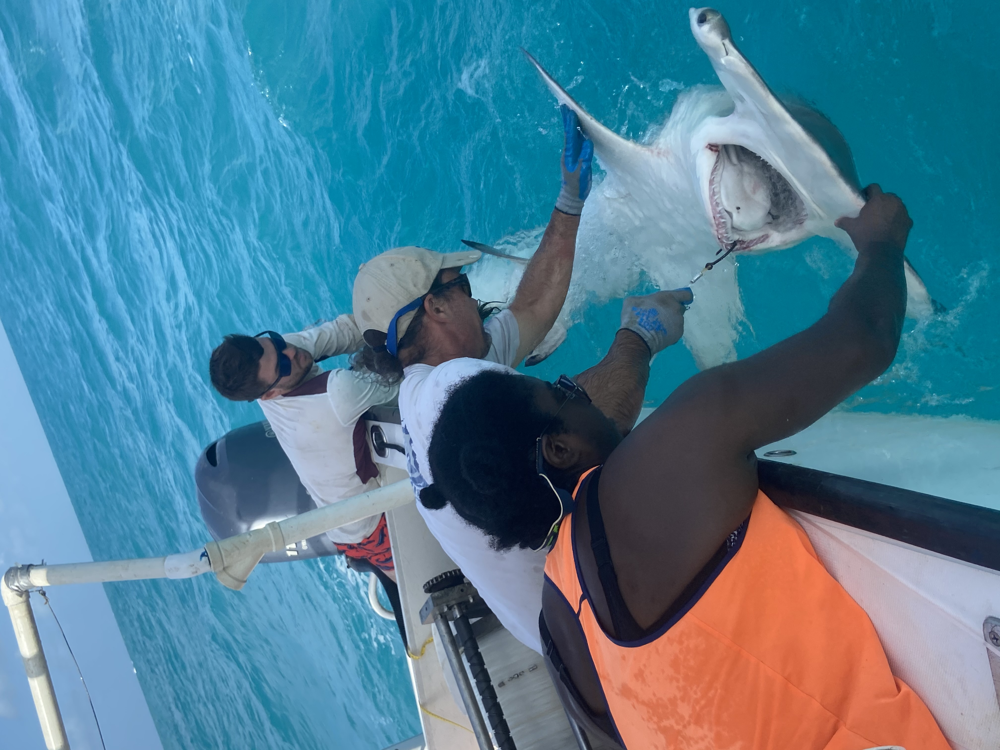

 
 

Twitter Handle: @Elasmo_Gal 

Websites: 
* [Personal Website](grahamjr.weebly.com)
* [marscilace.org](marscilace.org)
* [misselasmo.org](misselasmo.org)

Pronouns: She / Her

Jasmin specializes in elasmobranch ecology and evolution. Her research interests include smalltooth sawfish movement ecology and hammerhead shark phylogeny. She is a member of the American Elasmobranch Society and has served on their Student Advisory Committee for two years. Jasmin has a passion for science education and making science more accessible for everyone. She is the project coordinator for the MarSci-LACE project at Mote Marine Laboratory, which is focused on researching and promoting best practices to recruit, support and retain minority students in marine science. She is also President and CEO of Minorities in Shark Sciences, which is an organization dedicated to supporting women of color in shark science. Her favorite part of marine science is that there is so much that is unknown about the ocean and the organisms that live there, so there is always more to learn and more to study. She joined the Black in Marine Science team because she wants to help open doors for more underrepresented minority students to join the exciting field of marine science. 

 
