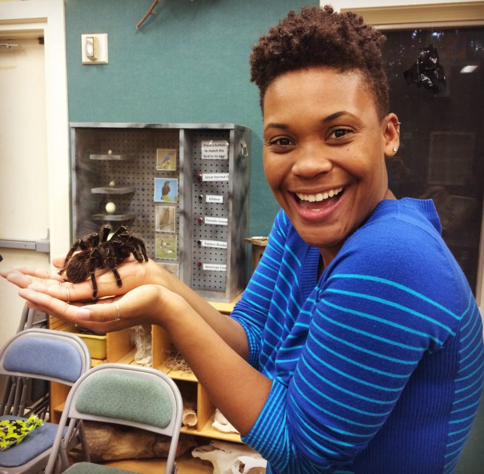
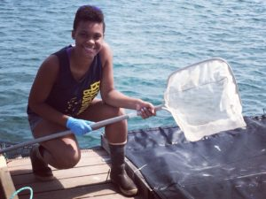

 
 

Twitter Handle: @Black_Ecologist

Pronouns: She / Her

I am currently a PhD student in the Odum School of Ecology at the University of Georgia. I am a disease ecologist who studies the impacts of human and environmental disturbances on disease transmission between humans and animals. I grew up outside of San Diego, CA, and fell in love with the ocean as a young child. I’ve previously worked with marine mammals and marine fish, and I used to work as a science educator at an aquarium. 