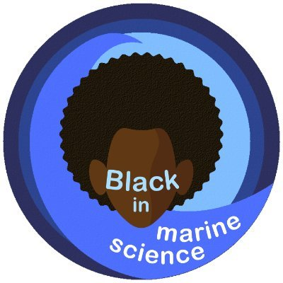

 
 
 

 

 

## *More information coming soon!*
 
 

 
 
<a class="twitter-timeline" data-width="500" data-height="750" href="https://twitter.com/BlackinMarSci?ref_src=twsrc%5Etfw">Tweets by @BlackinMarSci</a> 

